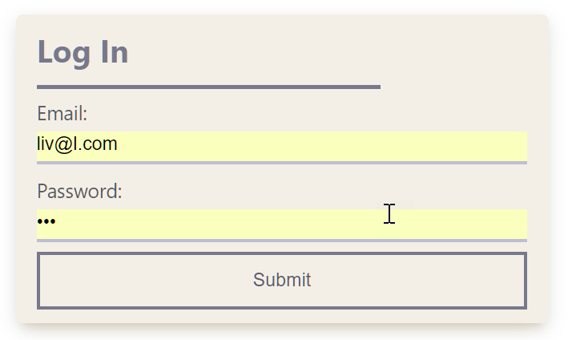
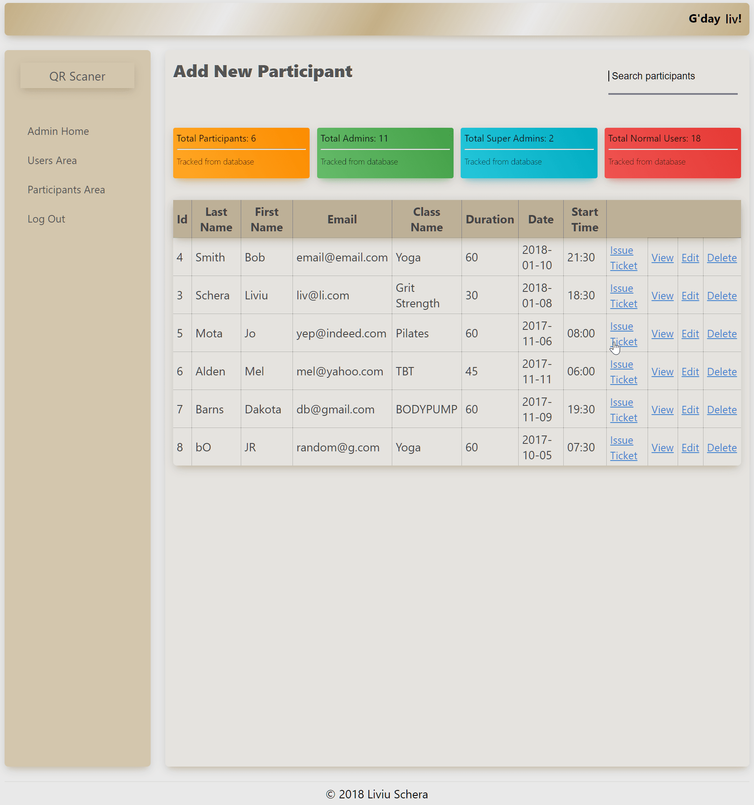
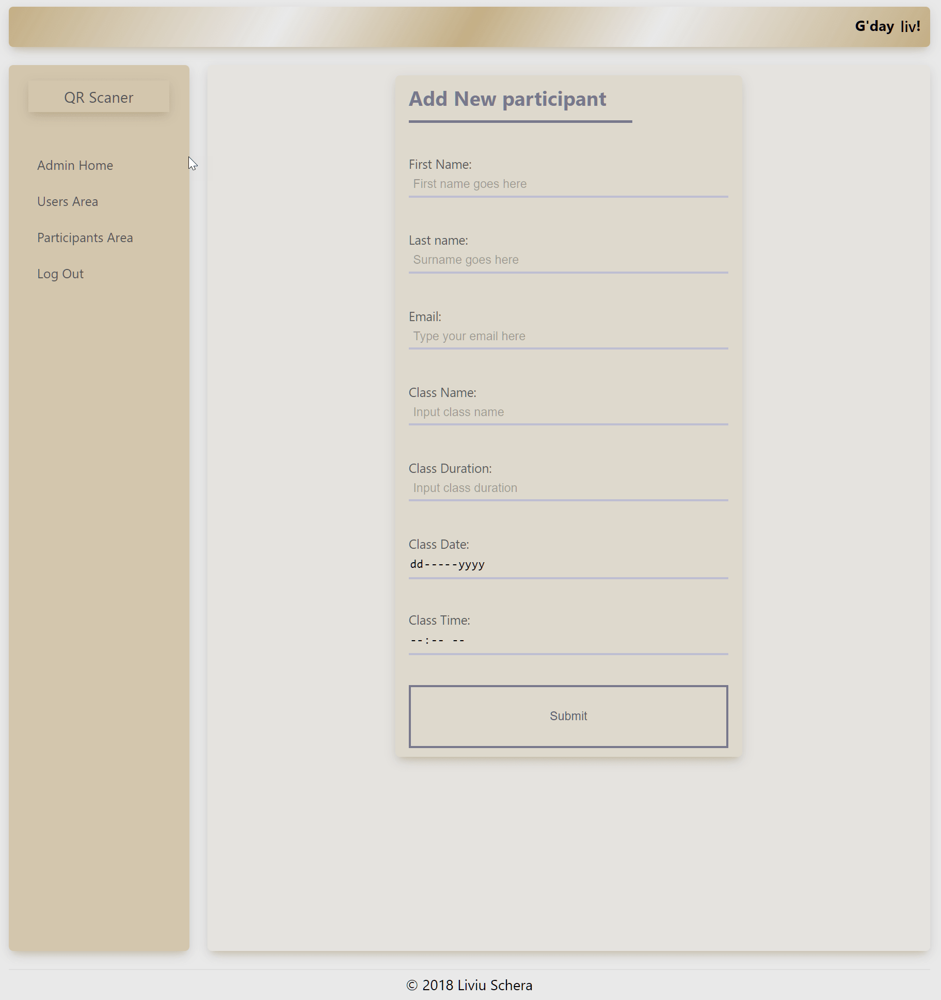
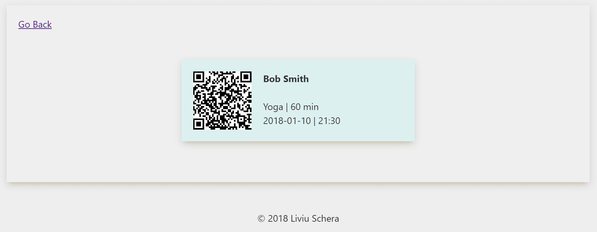
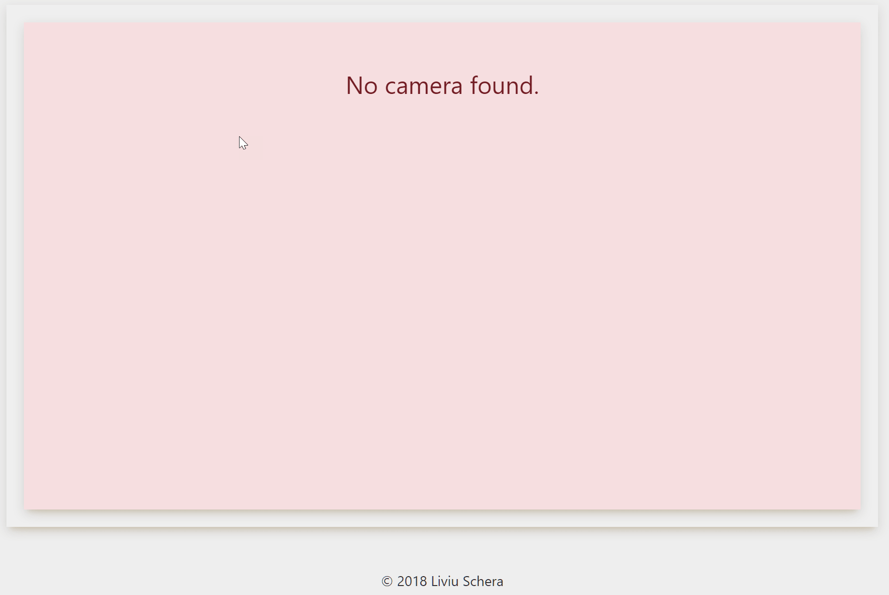

# QR Code Booking System

> The app is a booking system for a gym that enables the gym staff to create a profile for a new gym member or to update/remove a profile alltogether or to generate a single entry ticket to any gym member that wants to participate to a group fitness class.
>
> The ticket is to be scanned by the gym member with a device that has a camera (phone or tablet, etc.) and is mounted at the entrance of the group fitness room.
>
> I made this app for the CDU Code Fair Competition and is built on top of my [other project](https://github.com/liviuschera/cms) using just vanilla PHP and MySQL for the backend and CSS and a bit of JavaScript for the front end. I used 2 Javascript libraries for [scanning and decoding QR Code](https://github.com/schmich/instascan) and for [encoding a string into QR code](https://davidshimjs.github.io/qrcodejs/)

Here are some features:

*  The app has 2 parts:
   1. the front end user interface which will take care of scanning the QR Code on the ticket and give further instructions to the participant
   2. the back end which is a Content Management System and will allow the gym staff to add/remove/update a profile or issue a ticket to a participant

---

---

---

---

*  It generates a booking ticket for an upcomming class

*  The ticket enables access for participants to group fitness classes scanning the QR code

*  If there is no camera present en error message will be displayed

